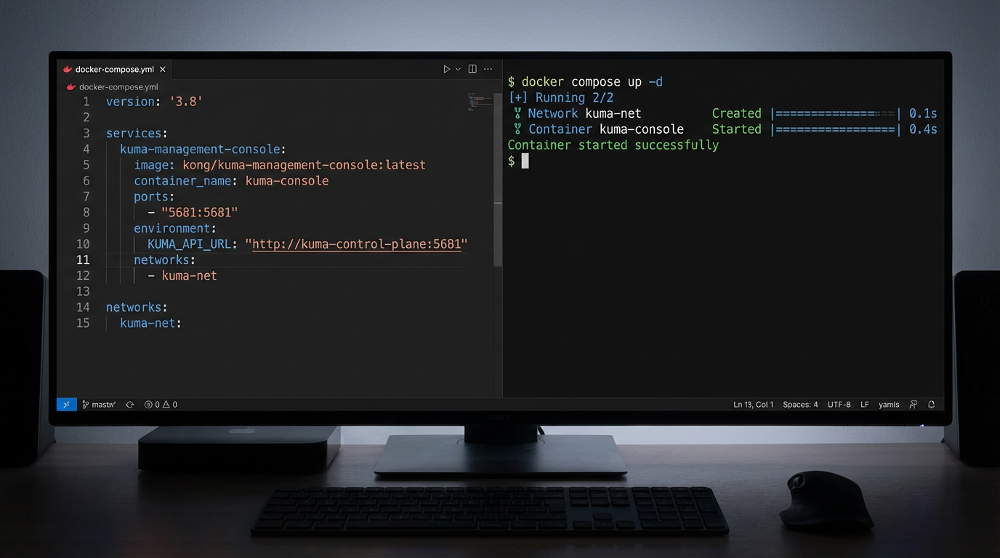

# kuma-management-console-deploy Tutorial

## UI Preview

*Docker Compose deployment setup*

## Prerequisites

- Docker and Docker Compose installed
- Port `5080` available
- Access to pull `KUMA_CONSOLE_IMAGE`

## Start Here

- Entry point: `apps/kuma-management-console-deploy/`
- Main file: `apps/kuma-management-console-deploy/docker-compose.yml`
- Runtime app: `apps/kuma-management-console/`

## First Successful Run

- `cd apps/kuma-management-console-deploy`
- `cp -n .env.example .env`
- `docker compose up -d`
- Open `http://localhost:5080`

## Common Tasks

- Pin image tag with `KUMA_CONSOLE_IMAGE` in `.env`
- Check logs with `docker compose logs --tail=100`
- Stop with `docker compose down`

## Troubleshooting

- Change host port mapping if 5080 is busy
- Verify image pull permissions and network access
- Re-check `.env` values if startup fails

## Update And Rollback

- Pull/update by running `docker compose up -d`
- Roll back by setting previous `KUMA_CONSOLE_IMAGE` tag and restarting
